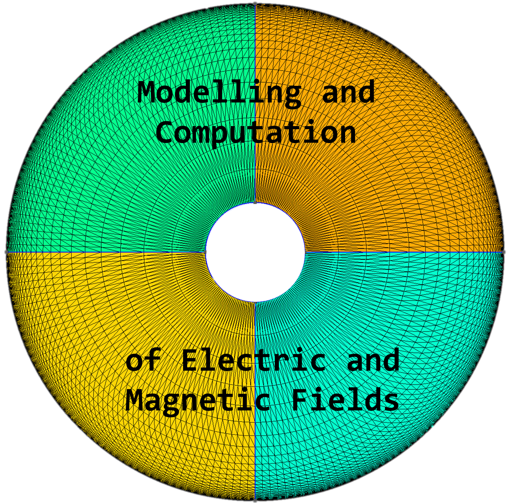

# Course repository for the 2025-2026 course at UniBo

## Recent updates

### INTEGRATION

- Fixed typo

### 1DFEM

- added expected results for all steps
- rewritten convergence test assignment (using a non-constant source term)

### FEM2D

- added example mesh for RG-59 coaxial cable capacitance calculation (see GMSH folder)*
- added more instructions

*NOTE: the example mesh is meant to show a meshing strategy tuned for AC current flow simulations, where skin effect is relevant. Since the TL inductance exercise is in DC, the mesh should be uniform along the radial direction. To achieve this, make sure to set to 1 the corresponding "Progression" parameter.
